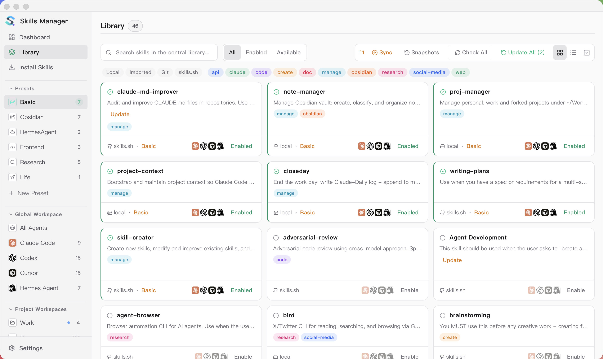
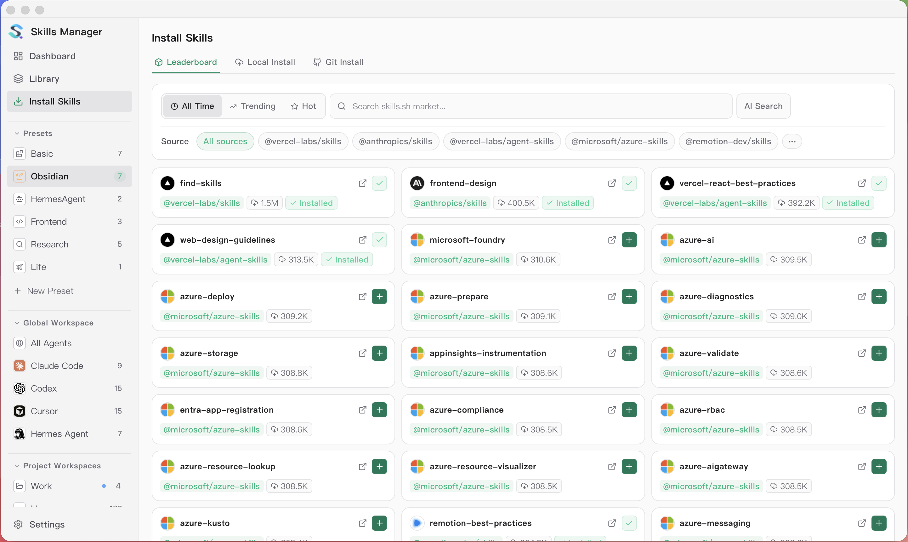
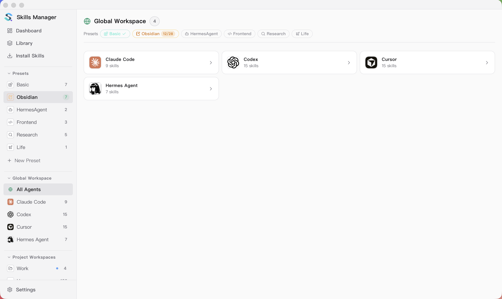
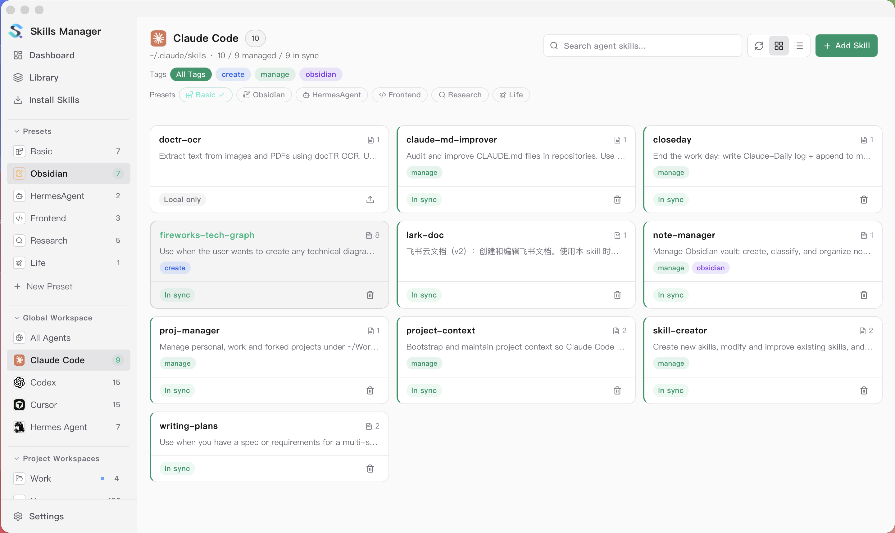

<p align="center">
  
</p>

<h1 align="center">Skills Manager</h1>

<p align="center">
  One app to manage AI agent skills across all your coding tools.
</p>

<p align="center">
  <a href="./README.zh-CN.md">中文说明</a>
  &nbsp;·&nbsp;
  <a href="https://x.com/JayTL00">@JayTL00 on X</a>
  &nbsp;·&nbsp;
  <a href="https://buymeacoffee.com/jaytl">Buy me a coffee</a>
</p>

<p align="center">
  
</p>

<p align="center"><strong>Install Skills — Marketplace</strong></p>
<p align="center"></p>

<p align="center"><strong>Global Workspace</strong></p>
<p align="center"></p>

<p align="center"><strong>Agent Workspace</strong></p>
<p align="center"></p>

<p align="center"><strong>Project Workspace</strong></p>
<p align="center"></p>

<p align="center"><strong>Settings</strong></p>
<p align="center"></p>

## Features

- **Unified skill library** — Install skills from Git repos, local folders, `.zip` / `.skill` archives, or the [skills.sh](https://skills.sh) marketplace. Everything goes into one central repo, which defaults to `~/.skills-manager` and can be customized in **Settings**.
- **Marketplace + AI search** — Browse popular skills from the marketplace, run keyword search, or enable SkillsMP AI search with your API key.
- **Presets** — Group skills into named presets. In any workspace, click a preset pill to instantly activate or deactivate all its skills for the current agent scope. The sidebar lists all presets for quick access.
- **Global Workspace** — Each agent gets its own page listing every skill in its global folder — including ones installed outside Skills Manager — so the view always reflects what the agent actually sees. Add or remove skills per agent, or use the All Agents overview to manage every installed agent at once.
- **Project Workspaces** — View and manage project-local skill folders for supported agents, compare them with your central library, and sync changes in either direction. Supports nested skill directories and per-agent assignment when exporting.
- **Linked Workspaces** — Point to any directory as a skills root — useful for skills that live outside the default agent paths. Managed as a standalone workspace without participating in global preset sync.
- **Multi-tool sync** — Sync skills to any supported tool via symlink or copy with a single click. Every skill card shows an agent icon badge per enabled agent — click a badge to install or remove that skill for that agent right from the card, with the badge reflecting live sync state.
- **Batch operations** — Multi-select skills for bulk enable/disable, export, or delete. Project Workspaces also support bulk enable/disable for project-local skills.
- **Skill tagging and filters** — Tag skills, use tags to group similar skills, and filter by source or tag to narrow large libraries quickly.
- **Update tracking** — Check for upstream updates on Git-based skills; re-import local ones.
- **Skill preview and source inspection** — Read `SKILL.md` / `README.md`, inspect source metadata, and compare local content with the upstream version inside the app.
- **Custom tools** — Add your own agents/tools with custom skills directories, or override the default path for any built-in tool.
- **Git backup and restore** — Version-control your skill library with Git for backup and multi-machine sync, then restore snapshot versions from Version History when needed.
- **Flexible app settings** — Configure repo path, sync mode, theme, text size, language, tray behavior, proxy, Git remote, update checks, and the order agents appear throughout the app — all in one place.

## Core Concepts

<p align="center">
  
</p>

- **Presets are reusable skill groups** — A preset is a named collection of skills. Activate a preset in any workspace to add all its skills to the selected agents; deactivate to remove them. Applying a preset is a one-time copy — not a live sync.
- **Global Workspace manages per-agent global skills** — Each installed agent has its own global skills folder (e.g. `~/.claude/skills/` for Claude Code). Each agent page lists everything in that folder — even skills installed without Skills Manager — so you can add, remove, or adopt them; the All Agents overview manages every agent at once.
- **Project Workspaces are project-local skill sets** — A project workspace manages the skills that live inside a specific project (e.g. `<project>/.claude/skills/`). Skills added here only apply to that project.
- **Tags are for grouping and filtering** — Use tags to label similar skills, then filter by tag to find the subset you want quickly.
- **Batch control works everywhere** — Multi-select skills in any workspace for bulk operations.

## Quick Start

1. Install skills from local folders, Git repositories, archives, or the marketplace. If you have a SkillsMP API key, you can also turn on AI search.
2. Open **Global Workspace** from the sidebar and pick an agent (e.g. Claude Code).
3. Click a **Preset** pill to activate its skills for that agent. Active presets show a ✓; partial installs show a count badge.
4. To manage project-local skills, open a **Project Workspace** and use the same preset pills or add skills individually.
5. Configure agent paths, custom tools, theme, language, proxy, and Git preferences in **Settings**.
6. If you want history or multi-machine sync, set a Git remote in **Settings** and run **Start Backup** or **Sync to Git** from **My Skills**.

## Git Backup

Back up the `skills/` folder inside your current central repository to a Git repo for version history and multi-machine sync. By default this is `~/.skills-manager/skills/`.

### Quick setup

1. Create a private repository (recommended).
2. Open **Settings → Git Sync Configuration** and save your remote URL.
3. Open **My Skills**.
4. Choose one:
- Existing remote: click **Start Backup** to clone from the configured remote.
- New local repo: click **Start Backup** to initialize locally, then use **Sync to Git**.
5. Use **Sync to Git** from the My Skills toolbar.

`Sync to Git` automatically handles pull, commit, and push based on current repo status.
Each successful sync creates a snapshot version tag. You can open **Version History** in **My Skills**, inspect the timeline, and restore any snapshot as a new commit.

### Authentication

- SSH URL (`git@github.com:...`): requires SSH key configured on your machine and added to GitHub.
- HTTPS URL (`https://github.com/...`): push usually requires a Personal Access Token (PAT).

> **Note:** The SQLite database (`skills-manager.db` inside your current central repository, `~/.skills-manager/skills-manager.db` by default) is not included in Git — it stores metadata that can be rebuilt by scanning the skill files.

## Supported Tools

Cursor · Claude Code · Codex · OpenCode · Amp · Kilo Code · Roo Code · Goose · Gemini CLI · GitHub Copilot · Windsurf · TRAE IDE · Antigravity · Clawdbot · Droid

You can also add custom tools in **Settings** and manage their skills the same way.

## In-App Help

The **Help** button in **Settings** mirrors the current product flow: recommended workflows, presets, skill installation, the Library, the Global Workspace, Project Workspaces, Git backup, and environment-level settings. It is intended as the in-app version of this quick-start guide.

## Tech Stack

| Layer | Tech |
|-------|------|
| Frontend | React 19, TypeScript, Vite, Tailwind CSS |
| Desktop | Tauri 2 |
| Backend | Rust |
| Storage | SQLite (`rusqlite`) |
| i18n | react-i18next |

## Getting Started

### Prerequisites

- Node.js 18+
- Rust toolchain
- [Tauri prerequisites](https://v2.tauri.app/start/prerequisites/) for your OS

### Development

```bash
npm install
npm run tauri:dev
```

### CLI

The repository now includes an agent-friendly CLI built on the same Rust shared core used by the desktop app. Repository bootstrap, tool resolution, scenario sync/apply logic, and metadata reindexing now live in reusable core modules instead of being reimplemented separately for CLI automation.

```bash
# Show the active repository paths and counts
npm run cli -- repo status

# List skills / inspect one skill
npm run cli -- skills list
npm run cli -- skills show db

# Preview or apply a scenario using the shared Rust core
npm run cli -- scenarios list
npm run cli -- scenarios preview Default
npm run cli -- scenarios apply Default

# Export one skill to another agent workspace
npm run cli -- skills export db --dest ~/.claude/skills/db

# Inspect or sync the git-backed skills repo
npm run cli -- git status
npm run cli -- git pull
npm run cli -- git commit -m "chore: update skills"
```

Available command groups:
- `repo` — inspect or change the configured base directory
- `tools` — list detected tool targets and paths
- `skills` — list, inspect, and export skills
- `scenarios` — list scenarios, preview sync targets, or apply one to default tool paths
- `git` — operate on the git-backed `skills/` repository (`clone`, `pull`, `push`, `commit`, `versions`, `restore`)

Extra flags:
- `--skills-root <path>` — operate on a cloned/exported skills repo directly instead of the local app default. The manager's state (DB, scenarios, cache, logs) lives in `~/.skills-manager/external/<name>-<hash>/`, namespaced by the canonical path of the skills root, so the external checkout itself stays clean.
- `--json` — machine-readable output for scripts/agents

```bash
npm run -s cli -- --skills-root /path/to/my-skills --json skills list
```

#### Install the binary on PATH

Agents and scripts that invoke `skills-manager-cli` directly (without `npm run`) need the binary on PATH. Install it with:

```bash
npm run cli:install
# equivalent to:
# cargo install --path src-tauri --bin skills-manager-cli --locked --force
```

This drops the binary at `~/.cargo/bin/skills-manager-cli`. Re-run after pulling updates to refresh it.

#### Concurrent use with the desktop app

The CLI and desktop app share the same SQLite database. SQLite serializes writes safely, but the running app does not auto-refresh its in-memory caches when the CLI mutates state — restart or trigger a manual refresh in the app after `scenarios apply`, `git pull`, or other CLI write operations.

### Build

```bash
npm run tauri:build
npm run cli:build
```

## Troubleshooting

### macOS: "App is damaged and can't be opened"

If you see this error after downloading the app, run the following command in Terminal and then open the app again:

```bash
xattr -cr /Applications/skills-manager.app
```

Replace the path with wherever you placed the `.app` file if it's not in `/Applications`.

## License

MIT
